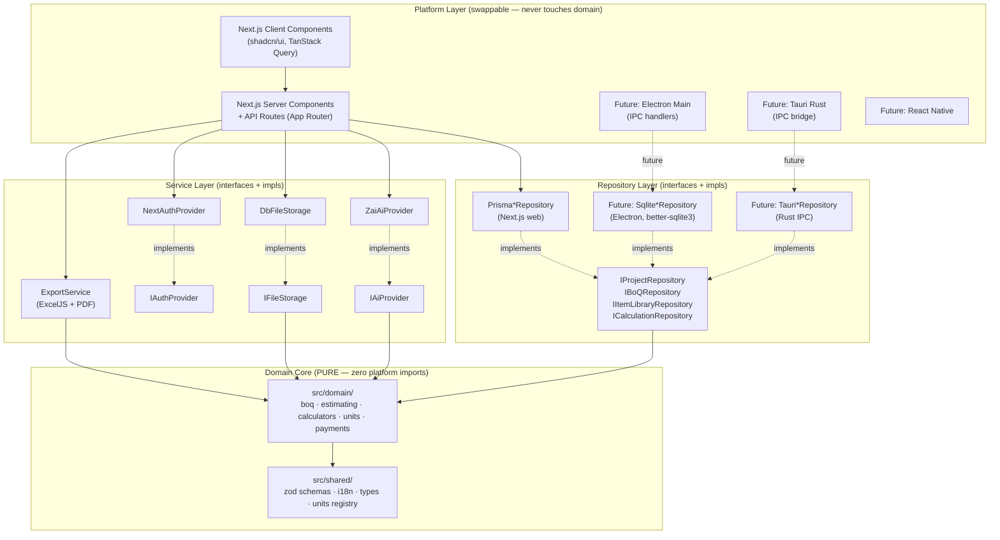

# TechOffice — Electron → Next.js 16 Adaptation Guide

**Document**: `docs/planning/ADAPTATION_GUIDE.md`
**Phase**: 0 (planning) — produced before any application code
**Governs**: All Phase 1 implementation decisions for the web MVP build
**Governing documents**: `CONSTITUTION_V1.1_WEB.md`, `SPEC_PHASE1_BOQ_WEB.md`, `ERD_V1.1_WEB.md`, `PLATFORM_PORTABILITY.md`, `IMPLEMENTATION_TODO_PHASE1.md`

---

## 1. Why This Document Exists

The original GLM 5.2 planning session (46 messages, 193 KB at `docs/imported/full-conversation.md`) planned a **desktop app** (Electron + better-sqlite3 + Ollama + electron-builder, distributed as `.exe`/`.AppImage`). The user has since chosen **Path C**: build a Next.js 16 web MVP first, then later take the same code to a desktop agent for Electron packaging.

This document is the **master translation table** — every Electron/desktop-specific decision in the original plan is converted to its Next.js 16 web-app equivalent, and the platform-agnostic architecture that makes that translation reversible is defined here.

The translation preserves the **Constitution's spirit** in full:
- Golden tests are law
- Domain core is pure (zero platform imports)
- AI proposes, engineer approves
- Data is never hostage
- Bilingual EN/AR with RTL from day one

---

## 2. Side-by-Side Translation Table

| # | Original (Electron / Desktop) | Adapted (Next.js 16 Web MVP) | What stays identical |
|---|-------------------------------|------------------------------|---------------------|
| 1 | Electron main process + IPC bridge (`ipcMain.handle` / `preload.contextBridge`) | Next.js API routes (App Router, `app/api/*/route.ts`) — typed fetch from client | The shape of the contract (request/response TypeScript types) — both can use the same zod schemas in `shared/` |
| 2 | `better-sqlite3` (local file DB, synchronous) | Prisma Client + SQLite (server-side, async) | SQL semantics; same table shapes (see ERD v1.1); soft-delete columns; UUID PKs |
| 3 | One project = one `.toproj` file (SQLite custom extension) | One project = one row in `Project` table + cascading child rows | The project aggregate's logical shape; the engineer's mental model "this is my project" |
| 4 | `electron-builder` NSIS + AppImage installers | Vercel-style web deployment (always-latest, no installer) | The product itself; users always get the latest version |
| 5 | Ollama local (fully offline AI, user's own model) | `z-ai-web-dev-sdk` server-side (BYO API keys, future-desktop BYO Ollama) | The `IAiProvider` interface in `services/ai/`; AI proposes, engineer approves |
| 6 | `electron-updater` (delta patches, version negotiation) | Web deployment (every page load = latest) | User never has to "update"; minor-version migrations happen server-side |
| 7 | `electron-store` for local user keys (encrypted JSON on disk) | Server-side env vars (server-only) + `UserSettings` table (per-user, in DB) | Keys never appear in client bundle; same security posture |
| 8 | CodeGraph (desktop semantic code index, dev-only) | **CodeGraph retained** (verified working in sandbox: `codegraph init` indexed 61 files / 627 nodes / 1,069 edges in 385ms). CodeGraph CLI is used by the implementing agent via Bash (`codegraph explore`, `callers`, `impact`, `affected`). **Complemented by** eslint layer-purity rules + zod schema↔table traceability table. CodeGraph = code understanding; eslint = mechanical purity enforcement — different purposes, both used. MCP server wiring (`codegraph install`) does NOT apply to Z.ai Code CLI (it targets Claude Code/Cursor/Codex only) — CLI invocation is the equivalent. | Dev-tooling-never-ships rule; layer law is mechanically enforced by eslint; CodeGraph index lives in `.codegraph/` (gitignored) |
| 9 | Desktop license activation (Ed25519-signed file, machine binding, 30-day grace) | Web subscription (auth-gated via NextAuth + per-user `Subscription` row in DB) | "You pay → you use; non-paying users are blocked at the auth layer" |
| 10 | Atomic file writes (write temp → rename) for `.toproj` save | DB transactions (Prisma `$transaction`) + WAL mode on SQLite | "Atomic, all-or-nothing" semantics; crash-safe |
| 11 | Snapshots in `<appdata>/snapshots/<project_uuid>/` (full DB copies) | `ProjectSnapshot` table + JSON dump stored as `FileUpload` blob | Version history; "restore previous version" UX |
| 12 | Conflict detection (SHA-256 of last published file vs file on disk) | Optimistic concurrency control (Prisma `@updatedAt` as version token, OR `version` int column with `where` check) | "Never silently overwrite; detect edit conflicts" |
| 13 | Attachments = gzipped BLOBs inside `.toproj` (truly portable) | `FileUpload` table (blob on disk/S3 + metadata in DB, sha256 tracked) | "One project carries all its files"; portable export packs attachments |
| 14 | Chromium print-to-PDF inside Electron main process | Server-side render (React render-to-string → Puppeteer/Chromium) **or** client-side print via `window.print()` on a print-optimized route | HTML→PDF path; Arabic shaping; cover/summary/section layout |
| 15 | ExcelJS inside main process (saves to disk) | ExcelJS server-side (returns a buffer; client downloads via `Content-Disposition`) | Same workbook layout; `rightToLeft: true` for Arabic |
| 16 | App DB (`app.db`) in user-data directory + Project DB (`.toproj`) — two databases | One Prisma DB with `userId`/`projectId` discriminator on every table | Logical separation: app-level reference data (Units, ItemLibrary) vs project-scoped data (BoQDocuments, Items) |
| 17 | "Offline means offline" (no feature may require internet) | "Web app must degrade gracefully" (offline indicator + service-worker cache for read-only views; AI/network are enhancements) | Core BoQ editing works against server cache; AI is enhancement, not dependency |
| 18 | "Email the .toproj file to a colleague" portability | "Export project as `.toproj`-like archive" (JSON + attachments zip) — Phase 1: stub; Phase 5: ship | Cross-machine portability; never data hostage |

---

## 3. Platform-Agnostic Architecture

The architecture below is the contract: **the same `src/domain/` runs unmodified in Next.js server, Next.js client (bundled), Electron main process, Tauri Rust-bridge, and React Native.** Only the outermost adapters change per platform.

### 3.1 Mermaid Diagram



### 3.2 ASCII Variant (for environments without Mermaid rendering)

```
┌─────────────────────────────────────────────────────────────────────┐
│  PLATFORM LAYER  (swappable; never imports domain directly)         │
│  ┌──────────────────┐  ┌─────────────────┐  ┌────────────────────┐  │
│  │ Next.js Client   │  │ Next.js Server  │  │ Future: Electron / │  │
│  │ (shadcn/ui)      │  │ + API Routes    │  │ Tauri / React Native│  │
│  └────────┬─────────┘  └────────┬────────┘  └─────────┬──────────┘  │
└───────────┼──────────────────────┼────────────────────┼──────────────┘
            │                      │                    │
            ▼                      ▼                    ▼
┌─────────────────────────────────────────────────────────────────────┐
│  SERVICE LAYER  (interfaces in src/services/, impls swappable)       │
│  IAiProvider  ◄── ZaiAiProvider (web) · OllamaProvider (future)      │
│  IFileStorage ◄── DbFileStorage (web) · NodeFileStorage (future)    │
│  IAuthProvider ◄── NextAuthProvider (web) · ElectronAuth (future)   │
│  ExportService (ExcelJS + Puppeteer — server-only)                   │
└─────────────────────────────────────────────────────────────────────┘
                              │
                              ▼
┌─────────────────────────────────────────────────────────────────────┐
│  REPOSITORY LAYER  (interfaces in src/domain/repositories/)          │
│  IProjectRepository  IBoQRepository  IItemLibraryRepository  …      │
│       ▲                 ▲                  ▲                          │
│       │                 │                  │                          │
│  PrismaProjectRepo  PrismaBoQRepo  PrismaLibraryRepo  (web)          │
│  SqliteProjectRepo  SqliteBoQRepo  SqliteLibraryRepo  (Electron)     │
│  TauriProjectRepo   TauriBoQRepo   TauriLibraryRepo   (Tauri)        │
└─────────────────────────────────────────────────────────────────────┘
                              │
                              ▼
┌─────────────────────────────────────────────────────────────────────┐
│  DOMAIN CORE (PURE — src/domain/)                                    │
│  boq/ totals.ts · estimating/ rate-analysis.ts · calculators/        │
│  units/ · payments/ (Phase 4A) · scheduling/ (Phase 2A)              │
│  ZERO imports of: fs, path, electron, next, react, browser APIs    │
└─────────────────────────────────────────────────────────────────────┘
                              │
                              ▼
┌─────────────────────────────────────────────────────────────────────┐
│  SHARED (src/shared/) — the bottom layer                            │
│  zod schemas/ · i18n/ (en.json, ar.json) · types/ · units registry  │
│  Imports nobody. Source of truth.                                   │
└─────────────────────────────────────────────────────────────────────┘
```

### 3.3 Layer Purity Rules (mechanically enforced by eslint)

| Layer | May import | May NOT import | Enforced by |
|-------|------------|----------------|-------------|
| `src/shared/` | (nothing — only stdlib types) | ui, services, domain, infrastructure, next, react, electron, fs, path | `eslint.config.mjs` `no-restricted-imports` |
| `src/domain/` | `@shared/*` only | ui, services, infrastructure, next, react, electron, node:*, fs, path, browser APIs | `eslint.config.mjs` `no-restricted-imports` |
| `src/services/` (interfaces) | `@shared/*`, `@domain/*` | ui, infrastructure, next, react, electron | `eslint.config.mjs` |
| `src/services/` (impls) | `@shared/*`, `@domain/*`, `@services/*` interfaces, `next`, `prisma`, platform SDKs | ui | `eslint.config.mjs` |
| `src/infrastructure/` (Prisma repos) | `@shared/*`, `@domain/*`, `@domain/repositories/*` interfaces, `@prisma/client`, `next/server` | ui | `eslint.config.mjs` |
| `src/app/` (Next.js App Router — UI + API routes) | everything below it in the stack | nothing — top of the stack | (default) |
| `src/components/` (React UI) | `@shared/*`, `@domain/*` types only (no domain logic), shadcn/ui, react, next/navigation | `@infrastructure/*`, `prisma`, server-only modules | `eslint.config.mjs` |

**Critical rule**: Domain code is isomorphic. The same `.ts` file must compile under:
1. Next.js server bundler (Node ESM)
2. Next.js client bundler (webpack/turbopack for browser)
3. Vitest (Node)
4. Future: Electron main (Node CJS/ESM)
5. Future: Tauri (via `ts-rs` or similar)
6. Future: React Native (Metro)

This is verified by the **isomorphic compile test** in CI (see `IMPLEMENTATION_TODO_PHASE1.md` WO-W-3).

---

## 4. "What Changes vs. What Stays" — Per Phase 1 Feature

| Feature | Stays identical | Needs adaptation | Cannot do in web MVP (honest) |
|---------|-----------------|------------------|-------------------------------|
| **F1** App shell & nav, language toggle, project switcher | Nav structure, EN/AR toggle, RTL mirroring, i18n keys | "Project switcher" = dropdown of user's projects (server-fetched) vs. desktop's "recent files" list | True "open any file from disk" — replaced with "select from my projects" |
| **F2** Project create/open/rename/delete | Project fields (name, client, location, contract no., currency, VAT settings) | Create = `POST /api/projects` (DB transaction) not "save .toproj to disk"; delete = soft-delete row with confirm modal | "Email a single `.toproj` file" — Phase 5 will add "Export project archive" feature |
| **F3** BoQ builder (documents → sections → items) | All BR-2..BR-7 calculation law; drag reorder; inline editing; type badges; sticky totals | Items fetched via TanStack Query; mutations via PATCH endpoints; optimistic updates with rollback on error | None — fully feasible in web |
| **F4** Rate analysis | All BR-8..BR-10; four component groups; both labor modes; Apply-to-item with restore | Same as F3 — server-persisted via `RateAnalysis` + `RateAnalysisLine` tables | None |
| **F5** Calculators (concrete, formwork, rebar, masonry, plaster, paint) | All formulas (GT-3..7); calculator input schemas; audit-trail records; orphan-safe links | Calculation records stored in DB; "apply to BoQ item" = PATCH item's qty + POST `CalculationRecord` | None — pure domain, fully portable |
| **F6** Item library (EN/AR catalog) | ~150 seed items; search EN+AR; insert into BoQ; save item to library | Library is `ItemLibrary` table (server-side); search = `GET /api/library?q=` | None |
| **F7** Excel BoQ import (deterministic wizard) | Wizard steps; column mapping; unit alias resolution; validation report; section detection; provenance (`ImportBatch` table) | Upload file → server parses with ExcelJS → returns parsed+validated JSON → user reviews → `POST /api/boq-documents/import` finalizes | "Drag a file from disk into the app window" — replaced with `<input type="file">` |
| **F8** Export center (Excel/PDF, EN/AR/bilingual) | Layout contract (§8 of spec); `rightToLeft: true` for Arabic; cover/summary/sections; running page numbers | ExcelJS runs server-side → returns `.xlsx` blob for download; PDF via Puppeteer server-side render OR `window.print()` on a print route | True WYSIWYG print preview inside the app window (we get close with print CSS) |
| **F9** Settings (app, project, company profile) | All settings fields; VAT toggle propagates to totals; precision overrides; OH/profit defaults | App settings = `UserSettings` table (per user); project settings = columns on `Project`; company profile = `CompanyProfile` table | "Default save location on disk" — N/A in web (server decides) |

---

## 5. Honest "Cannot Do in Web MVP" List

The Constitution demands honesty over promises. These items **cannot be delivered** in a Next.js web MVP, and Phase 1 will not pretend otherwise:

### 5.1 Hard Cannot-Do's (architectural)

| # | Cannot do | Why | Mitigation / Phase |
|---|-----------|-----|-----|
| 1 | **True offline mode** | Web app requires a server roundtrip for any DB write. Service workers can cache reads but cannot accept writes when offline. | Service worker caches the user's last-opened project for **read-only** view; mutation attempts show "Reconnect to save". Electron port restores true offline. |
| 2 | **`.toproj` file save to disk** | Browser sandbox has no arbitrary file-write API (File System Access API exists but only in Chromium and requires explicit user gestures per save). | Phase 5 will add "Export project archive" (zip of JSON + attachments) for portability. The desktop (Electron) port will write true `.toproj` files. |
| 3 | **Local Ollama AI (fully private, no API keys)** | Ollama runs on `localhost:11434`; the browser can call it directly, but we standardize on server-side AI for security and consistency. | `IAiProvider` interface lets a future Electron build wire `OllamaProvider` directly. Web MVP uses `ZaiAiProvider`. |
| 4 | **DXF/DWG native in-app viewer** | Original Phase 3 plan: parse DXF natively. Web can render DXF via WebGL/Three.js, but DWG conversion requires the ODA File Converter (native binary). | Phase 3 (out of Phase 1 scope) will adapt: DXF viewer via web WebGL; DWG conversion via server-side ODA binary if licensed, otherwise DXF-only. |
| 5 | **Single-file project portability (one file = one project)** | Web stores projects in a relational DB across many tables; "one file" requires an export/import archive round-trip. | Phase 5 export-archive feature; desktop port restores single-file model. |
| 6 | **Auto-updater with delta patches** | Web is always-latest by definition; no patch mechanism needed or possible. | N/A — web deployment model. |
| 7 | **Desktop license activation (Ed25519-signed file, machine binding)** | Web uses auth-gated subscription; no machine binding concept. | NextAuth + `Subscription` table; Future Electron port can re-introduce offline license files for desktop parity. |

### 5.2 Soft Cannot-Do's (workable but degraded)

| # | Cannot do (perfectly) | Why | Mitigation |
|---|----------------------|-----|------------|
| 8 | **5,000-item grid at 60fps with zero network calls** | Each mutation in web is a server roundtrip; optimistic updates mask latency but cannot eliminate it. | TanStack Query cache + virtual scrolling (`@tanstack/react-virtual`) + optimistic mutations; recompute stays client-side (pure domain, so sub-300ms locally). |
| 9 | **WYSIWYG print preview inside the app window** | Browser print dialog is OS-native; we cannot render a perfect preview thumbnail. | Dedicated print route (`/projects/[id]/print`) with print-optimized CSS; `window.print()` opens native dialog. PDF export via Puppeteer for a "true" preview. |
| 10 | **Truly zero data loss on kill-mid-edit** | Browser tab close kills in-flight requests; service worker can queue writes but not guaranteed delivery. | Debounced autosave (2s) + `beforeunload` warning on dirty state + server-side draft persistence (`DraftBoQItem` table) for "resume editing" UX. |

---

## 6. Migration Path (Web MVP → Electron Desktop)

When the user takes this to a desktop agent for Electron packaging, the following changes:

| Folder | What changes | What stays |
|--------|--------------|------------|
| `src/domain/` | **Nothing changes** | All calculation logic, types, zod schemas — byte-identical |
| `src/shared/` | **Nothing changes** | i18n strings, units registry, type defs |
| `src/services/ai/` | Add `OllamaProvider` impl; swap default in `providerRegistry.ts` | `IAiProvider` interface, `ZaiProvider`, request/response types |
| `src/services/fileStorage/` | Add `NodeFileStorage` impl (uses `fs/promises`) | `IFileStorage` interface, `DbFileStorage` impl |
| `src/infrastructure/` | Add `Sqlite*Repository` impls (better-sqlite3 directly) | `Prisma*Repository` impls, repository interfaces |
| `src/electron/main.ts` (NEW) | Electron main process + IPC handlers wiring repositories to renderer | — |
| `src/electron/preload.ts` (NEW) | contextBridge exposing typed repo APIs | — |
| `src/app/` (Next.js routes) | Becomes Electron renderer entry; same React components | All UI components, shadcn/ui, TanStack Query hooks |
| `prisma/` | May be replaced with direct better-sqlite3 (faster for desktop) — but Prisma also supports SQLite so could stay | Schema definitions |
| `package.json` | Add `electron`, `electron-builder`, `better-sqlite3` deps; add `electron-builder` config | All existing deps |

**Estimated rework for Electron port**: ~15% of codebase (the outermost layer); ~85% ported verbatim.

---

## 7. Cross-Platform Build Matrix

| Folder | Platform-agnostic? | Next.js Web | Electron | Tauri | React Native |
|--------|--------------------|-------------|----------|-------|--------------|
| `src/domain/` | ✅ 100% | ✅ | ✅ | ✅ | ✅ |
| `src/shared/` | ✅ 100% | ✅ | ✅ | ✅ | ✅ |
| `src/services/ai/interfaces.ts` | ✅ 100% | ✅ | ✅ | ✅ | ✅ |
| `src/services/ai/zai-provider.ts` | 🟡 server-only | ✅ server | ❌ (no SDK) | ✅ server | ❌ |
| `src/services/ai/ollama-provider.ts` (future) | ✅ HTTP-based | ✅ | ✅ | ✅ | ✅ |
| `src/services/fileStorage/` | 🟡 impl-specific | ✅ `DbFileStorage` | ✅ `NodeFileStorage` | ✅ Rust-bridge | ✅ `RnFileStorage` |
| `src/infrastructure/prisma/` | 🟡 web/Electron | ✅ | ✅ (Prisma+SQLite) | ❌ | ❌ |
| `src/infrastructure/sqlite/` (future) | 🟡 Electron-only | ❌ | ✅ | ❌ | ❌ |
| `src/components/` (UI) | ✅ React | ✅ | ✅ | ✅ | 🟡 (RN primitives needed) |
| `src/app/` (Next.js routes) | ❌ Next.js-specific | ✅ | 🟡 (reuse components) | 🟡 | ❌ |
| `prisma/` | 🟡 | ✅ | ✅ | ❌ | ❌ |

Legend: ✅ = works as-is · 🟡 = works with adapter/impl swap · ❌ = needs replacement

---

## 8. Tooling Substitutions

| Original tool | Web equivalent | Notes |
|---------------|----------------|-------|
| `electron-vite` | `next dev` / `next build` | Next.js 16 App Router |
| `vitest` | `vitest` (unchanged) | Runs pure domain tests; no Electron needed |
| `electron-builder` (NSIS/AppImage) | `next build` + Vercel deploy | Or any Node host (Cloudflare, fly.io, self-host) |
| `better-sqlite3` native proof | Prisma migration on SQLite | No native module to prove — Prisma handles it |
| CodeGraph dev tool | eslint layer-purity rules + zod↔table round-trip tests | Same goal (keep AI on rails), different mechanism |
| `electron-store` (encrypted JSON) | NextAuth session + DB-backed `UserSettings` | Same outcome (secure per-user secrets) |
| `electron-updater` | Web deploy (always-latest) | Eliminates an entire class of bugs |
| Puppeteer (for PDF) | Puppeteer server-side OR `window.print()` | Same HTML→Chromium→PDF path |
| ExcelJS | ExcelJS (server-side) | Identical library, different runtime |

---

## 9. What This Document Does NOT Do

- Does not rewrite the Constitution — that is `CONSTITUTION_V1.1_WEB.md`
- Does not redefine Phase 1 features — that is `SPEC_PHASE1_BOQ_WEB.md`
- Does not redefine the data model — that is `ERD_V1.1_WEB.md`
- Does not list implementation tasks — that is `IMPLEMENTATION_TODO_PHASE1.md`
- Does not write any code — Phase 0 is planning only

This document is the **translation layer** between the original desktop plan and the new web build, and the **architectural contract** that makes future cross-platform ports cheap.

---

## 10. Approval & Next Steps

- ✅ Approved by user (implicit — user chose Path C explicitly)
- ⬜ Reviewed against `CONSTITUTION_V1.1_WEB.md` (cross-check layer rules match)
- ⬜ Reviewed against `ERD_V1.1_WEB.md` (cross-check repository interfaces map to tables)
- ⬜ Implementation can begin once `IMPLEMENTATION_TODO_PHASE1.md` tasks WO-W-0 through WO-W-2 are scaffolded

**End of document.**
