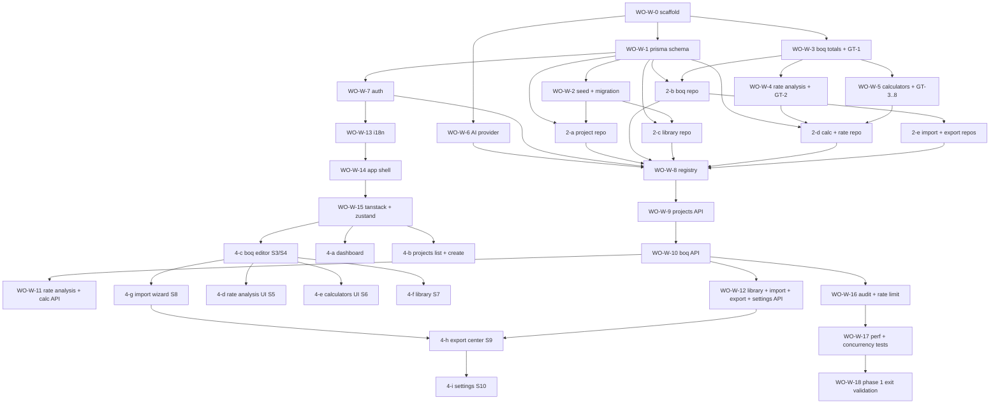

# Phase 1 Implementation TODO — Web MVP (TechOffice)

**Document**: `docs/planning/IMPLEMENTATION_TODO_PHASE1.md`
**Scope**: Concrete work-order breakdown for Phase 1 (BoQ MVP) of the Next.js 16 web app
**Source**: Adapted from `docs/imported/full-conversation.md` turn 26 (EXECUTION_PHASE1.md WO-0..16)
**Governing docs**: `CONSTITUTION_V1.1_WEB.md`, `SPEC_PHASE1_BOQ_WEB.md`, `ERD_V1.1_WEB.md`, `PLATFORM_PORTABILITY.md`, `ADAPTATION_GUIDE.md`

> **Convention**: Work orders are numbered **WO-W-N** (Web). The original desktop work orders were WO-N; WO-W-N mirrors them but adapted for Next.js. Parallelizable tasks share a parent group ID (e.g., **2-a, 2-b, 2-c** = three tasks in group 2 that can run concurrently).

---

## 0. Global Rules (every WO obeys these)

1. **One work order at a time, in dependency order** — never skip ahead.
2. **Golden test expected values are untouchable.** A GT failure means the code is wrong. If you believe the GT itself is wrong: STOP and report — never edit it.
3. **`docs/` is read-only** (exception: appending to `docs/decisions/`).
4. **Commit with the given message after each WO.**
5. **Two failed attempts on a WO → stop, collect the full error text, report to owner.**
6. **Domain code is pure** — no imports of `next`, `react`, `prisma`, `fs`, `path`, `electron`. Verified by eslint + isomorphic compile test.
7. **i18n keys only** — no hardcoded strings in components.
8. **decimal.js for all money/qty** — floats never touch money.
9. **All API routes validate input via zod** (`src/shared/schemas/`).
10. **All mutations write to AuditLog** (BR-WEB-8).

---

## 1. Work-Order Sequence

### Group A — Scaffold + Tooling (sequential)

| WO | Name | Files to create | Test | Dependencies | Commit message |
|----|------|-----------------|------|---------------|----------------|
| **WO-W-0** | Project scaffold + lint purity rules | `eslint.config.mjs` (update with `no-restricted-imports` rules per ADAPTATION_GUIDE §3.3); `tsconfig.json` (add `@domain`, `@shared`, `@infrastructure`, `@services` path aliases); `tsconfig.domain.json` (for isomorphic test); `vitest.config.ts` (alias map); `src/domain/.gitkeep`, `src/shared/.gitkeep`, `src/services/.gitkeep`, `src/infrastructure/.gitkeep` | `bun run lint` passes; `bun run typecheck` passes; try importing `next` from `src/domain/test.ts` → lint error | — | `scaffold: phase 0 web complete` |

### Group B — Prisma Schema + Migrations (sequential after A)

| WO | Name | Files | Test | Deps | Commit |
|----|------|-------|------|------|--------|
| **WO-W-1** | Write Prisma schema from ERD v1.1 | `prisma/schema.prisma` (full rewrite — all Phase 1 models from `ERD_V1.1_WEB.md` §3-6: User, Session, VerificationToken, UserSettings, CompanyProfile, Subscription, FileUpload, AuditLog, Unit, UnitAlias, RebarDiameter, ShapeCode, Project, ProjectUnit, ProjectRebarDiameter, ProjectShapeCode, ProjectSnapshot, BoQDocument, BoQSection, BoQItem, RateAnalysis, RateAnalysisLine, CalculationRecord, ImportBatch, LibraryCategory, ItemLibrary) | `bun run db:generate` succeeds; `bun run db:push` creates tables | WO-W-0 | `wo-w-1: prisma schema` |
| **WO-W-2** | Seed script + initial migration | `prisma/seed.ts` (units, unit aliases per ERD §8.2, rebar diameters per §8.1, shape codes per §8.3, library categories per §8.4, 23 starter library items per §8.5 from turn 30 APPENDIX_SEED_DATA); `prisma/migrations/<ts>_init/` | `bun run db:seed` succeeds; query confirms 9 units, ~30 aliases, 13 rebar diameters, 8 shape codes, 10 categories, 23 items | WO-W-1 | `wo-w-2: seed data + initial migration` |

### Group C — Pure Domain Core + Golden Tests (sequential; this is the calculation law)

| WO | Name | Files | Test | Deps | Commit |
|----|------|-------|------|------|--------|
| **WO-W-3** | BoQ totals domain + GT-1 | `src/shared/schemas/boq/boq-item.ts` (zod); `src/domain/boq/totals.ts` (implements BR-2..BR-4: `computeBoqTotals(input): BoqTotals`, decimal.js ROUND_HALF_UP, string I/O); `tests/golden/gt1-boq-totals.test.ts` (un-skip, expected values from spec GT-1) | GT-1 green; 2 edge-case tests added with hand-computed values | WO-W-0 | `wo-w-3: boq totals + gt-1` |
| **WO-W-4** | Rate analysis domain + GT-2 | `src/shared/schemas/rate-analysis.ts`; `src/domain/estimating/rate-analysis.ts` (implements BR-8..BR-10: `computeRate(input): RateResult`; labor consumption-mode XOR crew-mode — both set = throw); `tests/golden/gt2-rate-analysis.test.ts` (un-skip, GT-2 values: direct 762.30 → +OH 838.53 → rate 964.31) | GT-2 green; 1 edge test (both labor modes set → throws) | WO-W-3 | `wo-w-4: rate analysis + gt-2` |
| **WO-W-5** | Calculators domain + GT-3..8 | `src/shared/schemas/calculator.ts`; `src/domain/calculators/concrete.ts` (GT-3: 0.30×0.30×3.00×12 = 3.24 m³); `formwork.ts` (GT-4: 4 faces × 0.30 × 3.00 × 12 = 43.20 m²); `rebar.ts` (GT-5: Ø12 × 11.25 m × 85 bars = 849.15 kg = 0.849 ton, uses BR-11 weight table); `masonry.ts` (GT-6: (18−3.60)×0.25 = 3.60 m³); `plaster.ts` (GT-7: (60−3)×2 = 114.00 m²); `paint.ts` (GT-8: GT-7 wall × 2 coats = 228.00 m²); `tests/golden/gt3-gt8-calculators.test.ts` (all un-skipped); `src/shared/units-registry.ts` (9 units, default precision per BR-6); `src/shared/rebar-weights.ts` (BR-11 values) | All GT-3..8 green; units registry + rebar table exported | WO-W-3 (zod) | `wo-w-5: calculators + gt-3..8` |

### Group D — Repository Layer (interfaces + Prisma impls — can parallelize after C)

| WO | Name | Files | Test | Deps | Commit |
|----|------|-------|------|------|--------|
| **2-a** | `IProjectRepository` interface + Prisma impl | `src/domain/repositories/project-repository.ts` (interface per PLATFORM_PORTABILITY §2.1); `src/infrastructure/persistence/prisma/project-repository.ts` (Prisma impl with optimistic concurrency via `version` column); `tests/integration/project-repo.test.ts` (create → update → optimistic concurrency conflict → soft delete → restore) | Integration test green: 2 simultaneous updates → second gets VersionConflictError | WO-W-1, WO-W-2 | `wo-w-2a: project repository` |
| **2-b** | `IBoQRepository` interface + Prisma impl | `src/domain/repositories/boq-repository.ts` (interface per §2.2); `src/infrastructure/persistence/prisma/boq-repository.ts` (list/create/update items, sections, documents; `computeDocumentTotals` uses `computeBoqTotals` from domain — repo doesn't compute, it delegates); `tests/integration/boq-repo.test.ts` | Test: 3 items in 2 sections → totals match GT-1 hand calc through the repo path | WO-W-1, WO-W-3 | `wo-w-2b: boq repository` |
| **2-c** | `IItemLibraryRepository` interface + Prisma impl | `src/domain/repositories/item-library-repository.ts`; `src/infrastructure/persistence/prisma/item-library-repository.ts` (search EN+AR via ILIKE on both columns; pagination); `tests/integration/library-repo.test.ts` | Search "concrete" returns 6+ results from seed; AR search "خرسانة" returns same | WO-W-1, WO-W-2 | `wo-w-2c: library repository` |
| **2-d** | `ICalculationRepository` + `IRateAnalysisRepository` interfaces + Prisma impls | `src/domain/repositories/calculation-repository.ts`; `src/domain/repositories/rate-analysis-repository.ts`; `src/infrastructure/persistence/prisma/calculation-repository.ts`; `src/infrastructure/persistence/prisma/rate-analysis-repository.ts`; `tests/integration/calc-repo.test.ts`; `tests/integration/rate-analysis-repo.test.ts` | Test: create calculation record → link to BoQ item → unlink (orphan-safe per F5) → record still exists with `linkedBoqItemId: null`; rate analysis apply-to-item sets `boq_item.rate` in same transaction | WO-W-1, WO-W-4, WO-W-5 | `wo-w-2d: calculation + rate-analysis repositories` |
| **2-e** | `IImportRepository` + `IExportRepository` + provider impls | `src/domain/repositories/import-repository.ts`; `src/domain/repositories/export-repository.ts`; `src/infrastructure/persistence/prisma/import-repository.ts`; `src/infrastructure/export/excel-export.ts` (ExcelJS, `rightToLeft: true` for Arabic); `src/infrastructure/export/pdf-export.ts` (Puppeteer server-side); `src/services/file-storage/types.ts`; `src/services/file-storage/db-file-storage.ts`; `tests/integration/import-repo.test.ts`; `tests/integration/export-repo.test.ts` | Test: import 10 rows → 10 BoQItem rows created in one transaction; export to .xlsx → buffer non-empty, opens in Excel; export to .pdf → buffer non-empty, opens in PDF viewer | WO-W-1, WO-W-2b | `wo-w-2e: import + export repositories` |

> **Parallelizable**: tasks 2-a, 2-b, 2-c, 2-d can be assigned to 4 separate subagents simultaneously (they share no files). 2-e depends on 2-b's `BoQItem` model.

### Group E — Service Layer (AI, Auth, Provider Registry)

| WO | Name | Files | Test | Deps | Commit |
|----|------|-------|------|------|--------|
| **WO-W-6** | AI provider interface + Zai impl | `src/services/ai/types.ts` (interface per PLATFORM_PORTABILITY §3.1; `proposal: boolean` always true); `src/services/ai/zai-provider.ts` (uses `z-ai-web-dev-sdk` — already in package.json); `tests/unit/zai-provider.test.ts` (mock the SDK, verify interface contract; never call real API in tests) | Unit test green: mock returns expected shape; `isAvailable()` returns true with valid API key | WO-W-0 | `wo-w-6: ai provider + zai impl` |
| **WO-W-7** | Auth provider + NextAuth config | `src/services/auth/types.ts`; `src/services/auth/next-auth-provider.ts`; `src/app/api/auth/[...nextauth]/route.ts` (NextAuth credential provider, email+password); `src/lib/auth.ts` (helper `getServerSession` wrapper); `src/lib/auth-options.ts` | Test: sign up via API → User created; sign in → session token issued; protected route without session → 401 | WO-W-1 | `wo-w-7: auth + nextauth` |
| **WO-W-8** | Provider registry + DI wiring | `src/infrastructure/registry.ts` (per PLATFORM_PORTABILITY §4.1); `src/lib/db.ts` (Prisma client singleton — already exists, update); `src/lib/services.ts` (per-request service factory) | Test: import registry → getRepositories() returns instances of correct impls | WO-W-6, WO-W-7, all of group D | `wo-w-8: provider registry` |

### Group F — API Routes (App Router `route.ts` files)

| WO | Name | Files | Test | Deps | Commit |
|----|------|-------|------|------|--------|
| **WO-W-9** | Project CRUD API routes | `src/app/api/projects/route.ts` (GET list, POST create); `src/app/api/projects/[id]/route.ts` (GET, PATCH with optimistic concurrency, DELETE soft-delete); `src/app/api/projects/[id]/restore/route.ts` | Test: 200/201/204/409/401 all return correct status; audit log rows created for each mutation | WO-W-8, 2-a | `wo-w-9: projects api` |
| **WO-W-10** | BoQ document/section/item API routes | `src/app/api/projects/[id]/documents/route.ts`; `src/app/api/documents/[id]/route.ts`; `src/app/api/documents/[id]/sections/route.ts`; `src/app/api/sections/[id]/route.ts`; `src/app/api/sections/[id]/items/route.ts`; `src/app/api/items/[id]/route.ts`; `src/app/api/items/[id]/reorder/route.ts`; `src/app/api/items/[id]/move/route.ts` | Test: create document → add 3 sections → add items to each → reorder → move item between sections → totals match GT-1 via API | WO-W-9, 2-b | `wo-w-10: boq api` |
| **WO-W-11** | Rate analysis + calculator API routes | `src/app/api/items/[id]/rate-analysis/route.ts`; `src/app/api/rate-analyses/[id]/route.ts`; `src/app/api/rate-analyses/[id]/apply/route.ts`; `src/app/api/projects/[id]/calculations/route.ts`; `src/app/api/calculations/[id]/route.ts`; `src/app/api/calculations/[id]/link/route.ts` | Test: GT-2 scenario through API applies 964.31 to item; GT-3 concrete calc creates record + applies to item | WO-W-10, 2-d | `wo-w-11: rate analysis + calc api` |
| **WO-W-12** | Library + Import + Export + Settings API routes | `src/app/api/library/route.ts` (search, POST create); `src/app/api/library/[id]/route.ts`; `src/app/api/imports/upload/route.ts` (multipart, 10MB limit per BR-WEB-2); `src/app/api/imports/[uploadId]/sheets/route.ts`; `src/app/api/imports/[uploadId]/mapping/route.ts`; `src/app/api/imports/[uploadId]/validation/route.ts`; `src/app/api/imports/[uploadId]/commit/route.ts`; `src/app/api/exports/excel/route.ts`; `src/app/api/exports/pdf/route.ts`; `src/app/api/settings/route.ts` (UserSettings + CompanyProfile + Project settings combined GET); `src/app/api/settings/user/route.ts`; `src/app/api/settings/company/route.ts`; `src/app/api/file-uploads/route.ts` | Test: upload small Excel file → parse → map columns → validate → commit → 5 items created; export Excel → buffer downloaded; export PDF → buffer downloaded | WO-W-8, 2-c, 2-e | `wo-w-12: library + import + export + settings api` |

### Group G — UI Components (shadcn/ui wrappers)

> Most shadcn/ui components are already installed (see `src/components/ui/`). This group wraps them with domain-specific behavior.

| WO | Name | Files | Test | Deps | Commit |
|----|------|-------|------|------|--------|
| **WO-W-13** | i18n setup + EN/AR strings | `src/shared/i18n/en.json` (full strings for S1-S10); `src/shared/i18n/ar.json` (full Arabic translations); `src/app/(app)/layout.tsx` (next-intl provider with locale from UserSettings via session); `src/components/language-toggle.tsx` (Client Component, calls PATCH /api/settings/user with new locale); RTL toggle via Tailwind `dir="rtl"` | Test: switch language → all visible strings switch → layout mirrors → setting persists across reload | WO-W-7 | `wo-w-13: i18n + language toggle` |
| **WO-W-14** | Layout shell (S1) | `src/app/(app)/layout.tsx` (sidebar nav: Dashboard, BoQ, Calculators, Library, Import, Export, Settings); `src/components/app-sidebar.tsx`; `src/components/top-bar.tsx` (project name + currency badge + language toggle); shadcn `Sheet` for mobile nav | Manual: sidebar renders, language toggle works, RTL mirrors, all nav links resolve | WO-W-13 | `wo-w-14: app shell s1` |
| **WO-W-15** | TanStack Query + Zustand setup | `src/components/providers.tsx` (QueryClientProvider + Zustand stores); `src/lib/queries.ts` (query key factory); `src/lib/mutations.ts` (mutation helpers with optimistic update + rollback pattern) | Test: a smoke Client Component can `useQuery` + `useMutation` against a test endpoint | WO-W-14 | `wo-w-15: tanstack query + zustand` |

### Group H — Screens S2-S10 (sequential after G; some parallelizable)

| WO | Name | Files | Test | Deps | Commit |
|----|------|-------|------|------|--------|
| **4-a** | Dashboard S2 | `src/app/(app)/projects/[id]/page.tsx` (Server Component fetches project + totals); `src/components/dashboard/cards.tsx`; `src/components/dashboard/quick-actions.tsx`; `src/app/(app)/page.tsx` (redirect to /projects or /projects/new if none) | Manual: dashboard shows grand total, per-document totals, item count, last modified; quick actions link to correct screens | WO-W-15, 2-a, 2-b | `wo-w-4a: dashboard s2` |
| **4-b** | Projects list + create S2 | `src/app/(app)/projects/page.tsx` (list user's projects); `src/app/(app)/projects/new/page.tsx` (create form: name, client, location, contract no, currency); `src/components/project-form.tsx` (react-hook-form + zod resolver); on submit calls POST /api/projects (BR-WEB-1 transactional create with seed snapshots) | Manual: create project → redirects to dashboard with seeded default BoQDocument; appears in projects list | WO-W-15, 2-a | `wo-w-4b: projects list + create` |
| **4-c** | BoQ editor S3/S4 | `src/app/(app)/projects/[id]/boq/[docId]/page.tsx` (BoQ editor screen); `src/components/boq/document-selector.tsx`; `src/components/boq/section-tree.tsx` (dnd-kit sortable, inline totals); `src/components/boq/items-table.tsx` (@tanstack/react-table + @tanstack/react-virtual for 5k perf); `src/components/boq/item-editor-sheet.tsx` (shadcn Sheet drawer, S4); `src/components/boq/grand-total-bar.tsx` (sticky bottom); `src/components/boq/renumber-button.tsx` (BR-7); keyboard handlers (Enter=commit+down, Tab=across) | Manual: 300-item BoQ built end-to-end via UI; 5k seeded project recomputes < 300ms (console.time); drag reorder persists; inline edit qty → totals update | WO-W-15, 2-b, WO-W-10 | `wo-w-4c: boq editor s3/s4` |
| **4-d** | Rate analysis UI S5 | `src/app/(app)/items/[id]/rate-analysis/page.tsx`; `src/components/rate-analysis/builder.tsx` (4 component groups, both labor entry modes, OH% + profit% from project defaults); `src/components/rate-analysis/live-result.tsx` (calls `computeRate` pure domain on every keystroke); `src/components/rate-analysis/apply-button.tsx` (POST /api/rate-analyses/[id]/apply + "undo" toast within 5s) | Manual: GT-2 scenario through UI applies 964.31 to item; switching labor mode clears the other; undo toast restores previous rate | WO-W-15, 2-d, WO-W-11, 4-c | `wo-w-4d: rate analysis s5` |
| **4-e** | Calculators hub S6 | `src/app/(app)/projects/[id]/calculators/page.tsx` (hub grid); `src/components/calculators/concrete.tsx`; `formwork.tsx`; `rebar.tsx`; `masonry.tsx`; `plaster.tsx`; `paint.tsx`; each: input form + add-row + live result panel + save-record + apply-to-item (with BR-13 confirm modal) + copy result; saved calculations list | Manual: GT-3..7 scenarios reproducible through UI; apply-to-item with existing qty shows confirm modal; orphaned record visible after item delete | WO-W-15, 2-d, WO-W-11, 4-c | `wo-w-4e: calculators s6` |
| **4-f** | Library browser S7 | `src/app/(app)/library/page.tsx`; `src/components/library/search-box.tsx` (debounced GET /api/library?search=); `src/components/library/category-tree.tsx`; `src/components/library/items-table.tsx`; "insert into BoQ" action (section picker modal → POST /api/items with libraryItemId); "save current item to library" from item editor | Manual: search "concrete" returns 6+ items (EN); search "خرسانة" returns same items (AR); insert into BoQ creates item with descriptionEn/ar copied; save-item-to-library creates user-scoped library item | WO-W-15, 2-c, WO-W-12 | `wo-w-4f: library s7` |
| **4-g** | Import wizard S8 | `src/app/(app)/projects/[id]/import/page.tsx` (multi-step wizard); `src/components/import/upload-step.tsx` (file input, .xlsx/.xls only, 10MB limit); `src/components/import/sheet-step.tsx`; `src/components/import/mapping-step.tsx`; `src/components/import/validation-step.tsx` (red errors, amber warnings, inline fix editors, skip-row checkbox); `src/components/import/commit-step.tsx`; state in TanStack Query cache between steps | Manual: upload small .xlsx → map columns → see validation report → fix one error → skip one row → commit → 8 items created in new BoQDocument with ImportBatch row | WO-W-15, 2-e, WO-W-12 | `wo-w-4g: import wizard s8` |
| **4-h** | Export center S9 | `src/app/(app)/projects/[id]/export/page.tsx`; `src/components/export/options-form.tsx` (document picker, scope, format, language, include rate analyses, include BBS); `src/components/export/preview-pane.tsx` (Server Component rendering the same HTML the export uses); `src/components/export/download-button.tsx` (POST /api/exports/excel or /pdf, save blob via browser); `src/app/projects/[id]/print/route.tsx` (print-optimized Server Component for `window.print()`) | Manual: select document, language=AR, format=PDF → preview pane shows Arabic RTL HTML → download button produces valid PDF with correct Arabic shaping; Excel download opens in Excel with `rightToLeft: true` on Arabic sheet | WO-W-15, 2-e, WO-W-12 | `wo-w-4h: export center s9` |
| **4-i** | Settings S10 | `src/app/(app)/settings/page.tsx` (3-tab layout); `src/components/settings/app-tab.tsx` (locale, theme via next-themes, autosave interval); `src/components/settings/project-tab.tsx` (currency, vatEnabled + vatPercent, precisionOverrides JSON, numberingPattern, OH% + profit% defaults); `src/components/settings/company-tab.tsx` (nameEn/ar, address, phone, email, logo upload via /api/file-uploads); mutations PATCH /api/settings/* | Manual: change VAT % on a project → BoQ grand total recomputes client-side immediately; change language → all UI switches; upload logo → appears in export cover sheet | WO-W-15, WO-W-12, 4-h | `wo-w-4i: settings s10` |

> **Parallelizable**: tasks 4-a, 4-b can run in parallel. 4-c is the critical path (largest). 4-d, 4-e, 4-f can run in parallel after 4-c. 4-g, 4-h can run in parallel. 4-i last.

### Group I — Hardening + Phase Exit

| WO | Name | Files | Test | Deps | Commit |
|----|------|-------|------|------|--------|
| **WO-W-16** | Audit log enforcement + rate limiting | `src/lib/audit-middleware.ts` (wraps every mutation in audit log write per BR-WEB-8); `src/lib/rate-limit.ts` (60 req/min/user per BR-WEB-10, returns 429 on exceed); apply to all `/api/*` routes | Test: POST /api/projects creates an AuditLog row; send 61 requests in 1 min → 61st returns 429 | All API WOs | `wo-w-16: audit + rate limit` |
| **WO-W-17** | 5k-item perf + concurrency tests | `tests/perf/boq-5k.test.ts` (seed 5k items, measure: list query < 500ms, total recompute via pure domain < 300ms, virtualized scroll maintains 60fps — manual via Playwright); `tests/e2e/multi-tab-conflict.test.ts` (Playwright: open project in 2 tabs, edit qty in tab 1, edit same item in tab 2 → second gets 409 with friendly modal) | Test: all green; Lighthouse Performance ≥ 80 on dashboard; LCP < 2.5s; TTI < 3s | WO-W-10, 4-c | `wo-w-17: perf + concurrency` |
| **WO-W-18** | Phase 1 exit criteria validation | `tests/e2e/phase1-exit.test.ts` (Playwright full user journey: sign up → create project → build 300-item BoQ → add 1 rate analysis per major trade → apply 3 calculator results → export EN xlsx + AR xlsx + bilingual PDF → all downloads valid); `docs/decisions/0001-phase-1-exit.md` (record of validation run) | Manual: pilot engineer signs off that GT-1..8 still match paper calcs; spec §10 exit criteria all checked | All previous WOs | `wo-w-18: phase 1 exit validation` |

---

## 2. Parallelization Map (for subagent assignment)

| Group | Tasks in group | Can run in parallel? | Suggested subagent assignment |
|-------|----------------|----------------------|--------------------------------|
| A | WO-W-0 | ❌ sequential (everything depends on it) | Subagent 1 alone |
| B | WO-W-1, WO-W-2 | ❌ sequential (W-2 needs schema from W-1) | Subagent 1 alone |
| C | WO-W-3, WO-W-4, WO-W-5 | ❌ sequential (calculation law builds up; WO-W-3 zod pattern reused) | Subagent 1 alone |
| D | 2-a, 2-b, 2-c, 2-d, 2-e | ✅ 2-a/b/c/d parallel; 2-e after 2-b | 4 subagents for 2-a/b/c/d, then 1 subagent for 2-e |
| E | WO-W-6, WO-W-7, WO-W-8 | 🟡 W-6 and W-7 parallel; W-8 after both | 2 subagents for W-6/W-7, then 1 for W-8 |
| F | WO-W-9..12 | ❌ sequential (routes depend on previous routes' patterns) | Subagent 1 alone |
| G | WO-W-13, WO-W-14, WO-W-15 | ❌ sequential | Subagent 1 alone |
| H | 4-a..4-i (9 tasks) | ✅ see notes in H section | Up to 3 subagents in parallel waves |
| I | WO-W-16, WO-W-17, WO-W-18 | ❌ sequential | Subagent 1 alone |

**Total WOs**: 18 numbered + 13 sub-tasks (2-a..e, 4-a..i) = **31 task units**, of which **9 can run in parallel** at peak (group D + parts of group H).

---

## 3. Task Dependency Graph (Mermaid)



---

## 4. Estimated Effort

| Group | Task count | Est. hours per task | Total est. hours | Notes |
|-------|------------|---------------------|-------------------|-------|
| A: Scaffold | 1 | 4h | 4h | Lint config + path aliases |
| B: Prisma | 2 | 6h | 12h | Schema + seed script |
| C: Domain + GTs | 3 | 8h | 24h | Calculation law — highest stakes |
| D: Repositories | 5 | 6h | 30h | Parallelizable: 4 subagents → ~12h wall time |
| E: Service layer | 3 | 6h | 18h | AI, auth, registry |
| F: API routes | 4 | 8h | 32h | Sequential |
| G: UI infra | 3 | 6h | 18h | i18n, shell, providers |
| H: Screens | 9 | 10h | 90h | Parallelizable: 3 subagents → ~30h wall time |
| I: Hardening | 3 | 8h | 24h | Sequential |
| **TOTAL** | **33 task-units** | — | **~252 hours** | ~6-7 weeks single-engineer; ~2-3 weeks with 3 parallel subagents on groups D + H |

---

## 5. Definition of Done — Phase 1 Exit Checklist

- ✅ All GT-1..8 green in CI (`bun run test`)
- ✅ Lint green (`bun run lint`)
- ✅ Typecheck green (`bun run typecheck`)
- ✅ Build green (`bun run build`)
- ✅ Isomorphic compile test green (domain compiles under 4 tsconfigs)
- ✅ Pilot engineer signs off on paper re-derivation of GT values (Constitution ritual)
- ✅ Pilot firm's real Excel BoQ imports via F7 wizard; totals match their Excel to the cent
- ✅ Pilot engineer builds full small-project BoQ (≥300 items, ≥1 rate analysis per major trade, ≥3 calculator applications) start-to-finish via web UI
- ✅ Exports (EN, AR, bilingual; xlsx + PDF) downloaded via browser, opened, approved
- ✅ No data-loss scenario: close tab mid-edit loses ≤ 2s of debounce; open project in 2 tabs → 2nd edit returns 409 with friendly modal
- ✅ Browser compat: Chrome, Firefox, Safari, Edge all pass golden paths
- ✅ Performance: Lighthouse Performance ≥ 80 on dashboard; LCP < 2.5s; TTI < 3s; 5k-item grid 60fps scroll + < 300ms recompute
- ✅ Audit log populated for every mutation (verify via `SELECT * FROM AuditLog ORDER BY createdAt DESC LIMIT 20`)
- ✅ All decisions appended to `docs/decisions/`

---

## 6. Handoff Prompt for Implementation Subagents

For every WO-W-N, paste this to the implementation subagent (change N):

```
Read /home/z/my-project/docs/planning/CONSTITUTION_V1.1_WEB.md,
     /home/z/my-project/docs/planning/SPEC_PHASE1_BOQ_WEB.md,
     /home/z/my-project/docs/planning/ERD_V1.1_WEB.md,
     /home/z/my-project/docs/planning/PLATFORM_PORTABILITY.md, and
     /home/z/my-project/docs/planning/IMPLEMENTATION_TODO_PHASE1.md
in full. Execute Work Order WO-W-N exactly. Obey the Global Rules (§0). Stop when the
Done-when criteria are met — nothing more. Commit with the given message.

Constraints:
- DO NOT skip ahead in the dependency order.
- DO NOT edit golden test expected values.
- DO NOT write to docs/ except docs/decisions/.
- DO NOT use hardcoded strings — all UI text via i18n keys.
- DO NOT use floats for money — decimal.js only.
- If you fail twice on the same WO, STOP and report the error.
```

---

**End of Implementation TODO — Phase 1.**
